
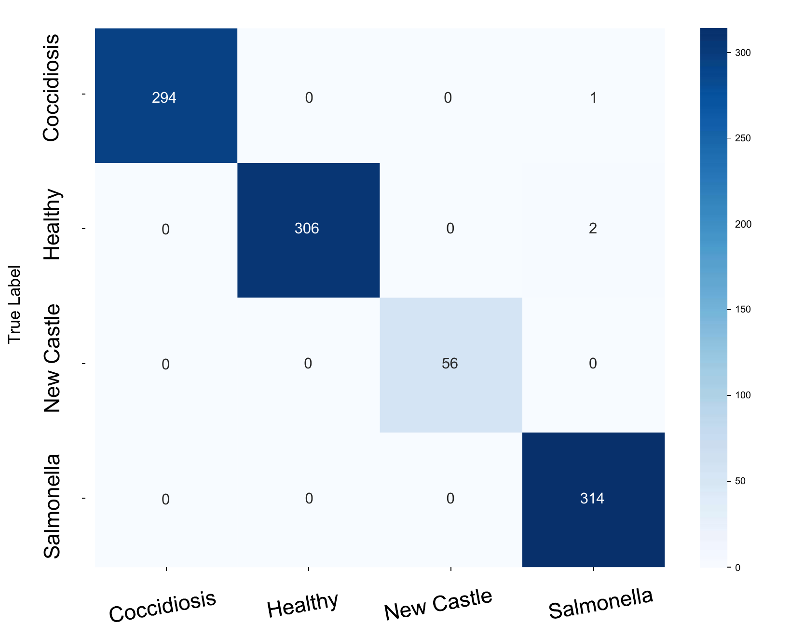
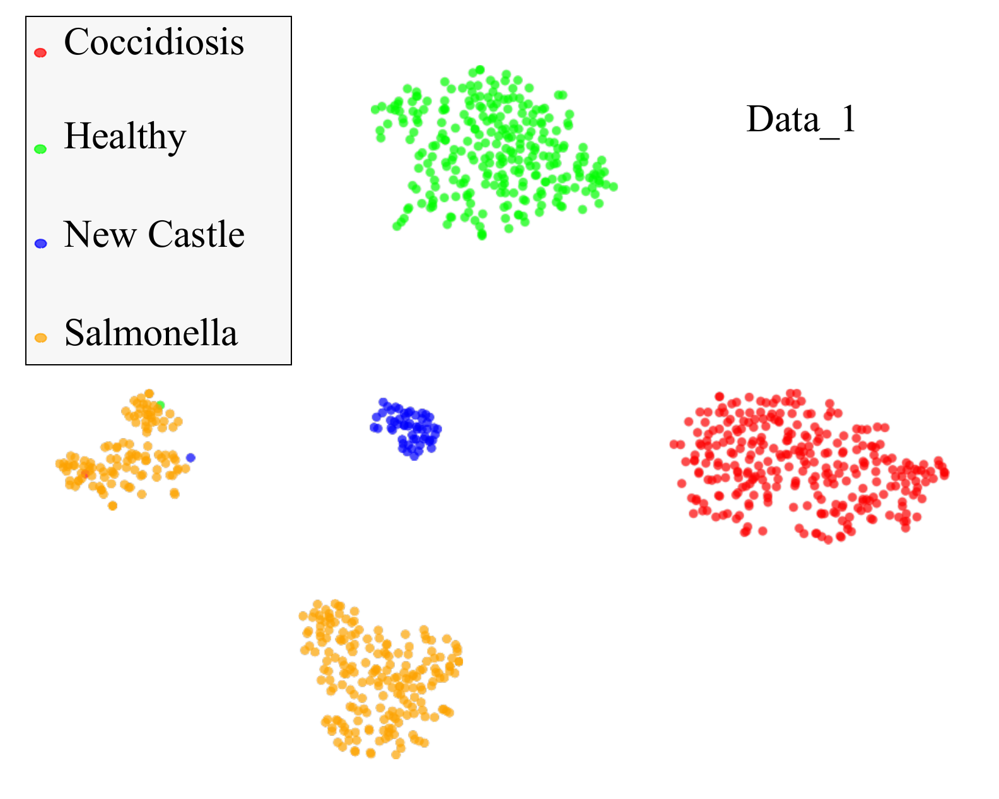
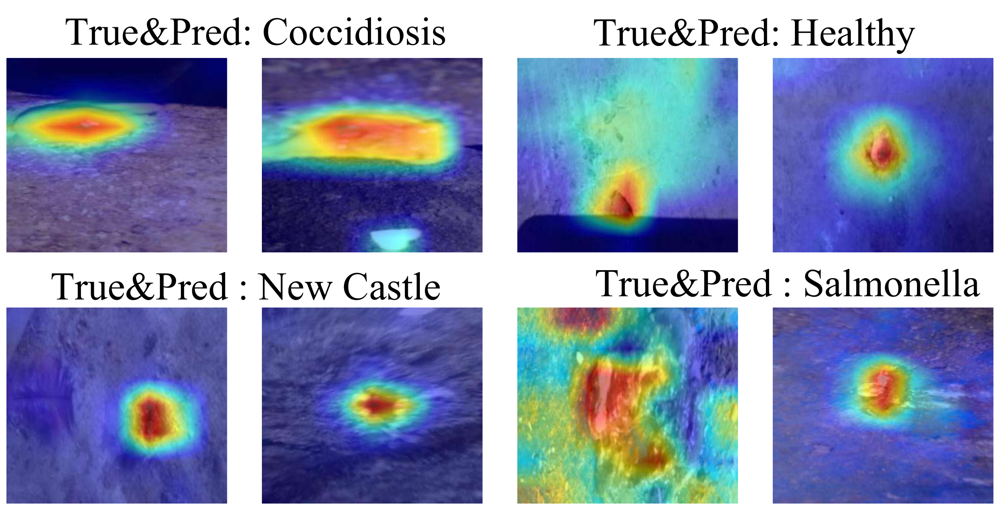
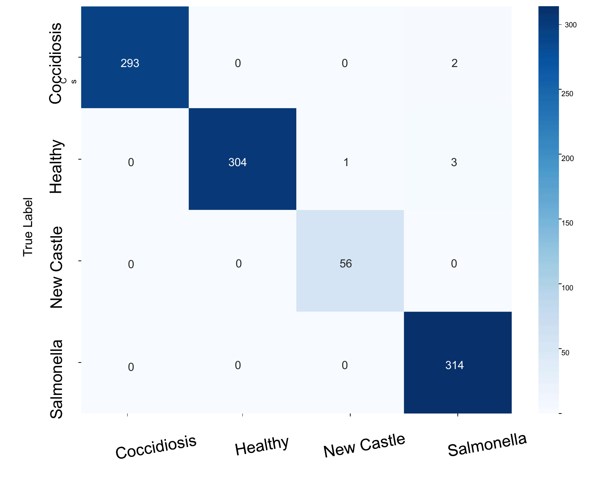
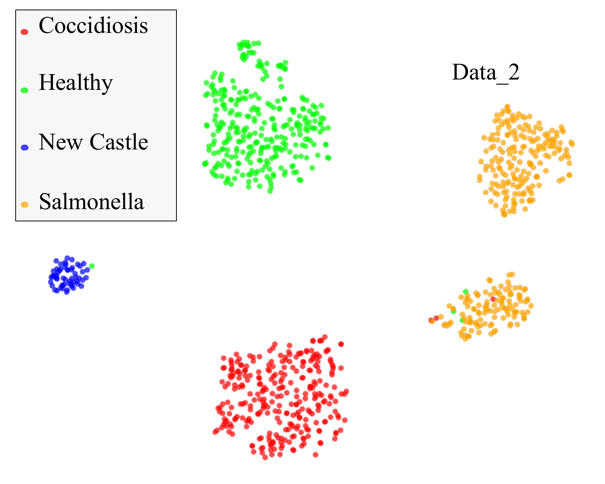
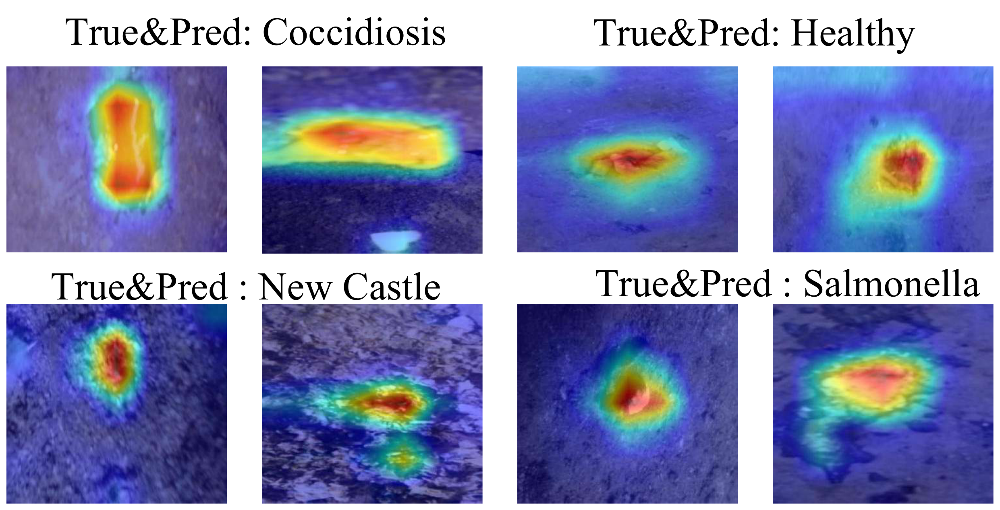
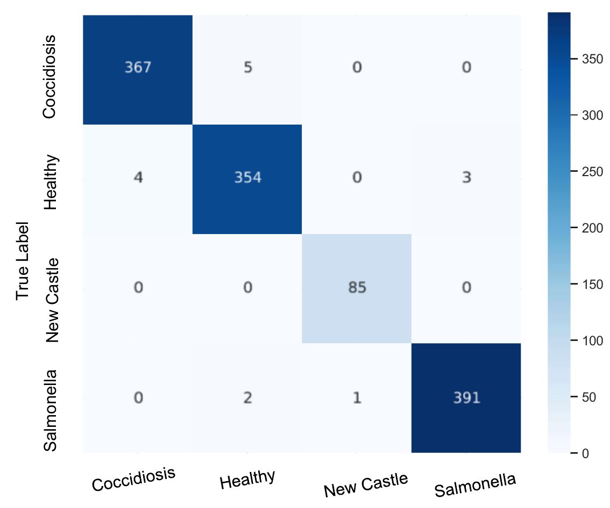
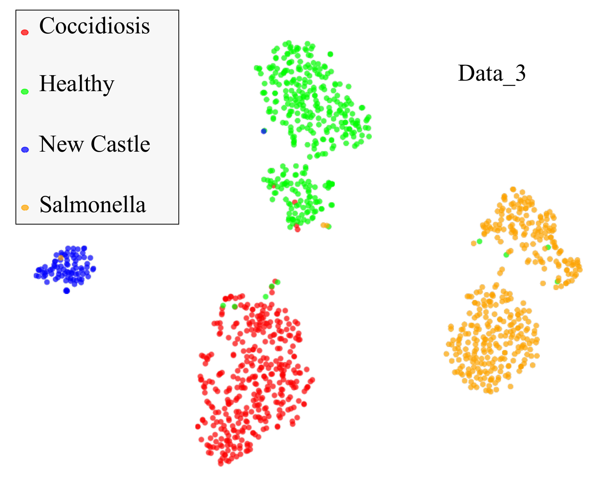
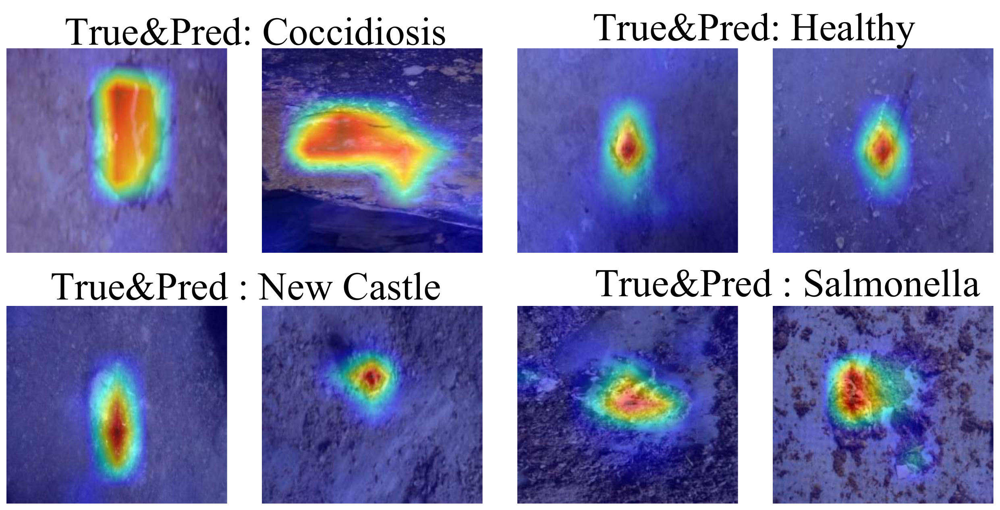

# S2M-KD

Official PyTorch implementation for **S2M-KD**, a cross-architecture knowledge
distillation framework for poultry disease classification from fecal images.
The method transfers representation knowledge from a Swin Transformer teacher to
a lightweight MobileNetV3 student for edge-oriented deployment.



## Highlights

- Swin Transformer teacher with MobileNetV3 student.
- Soft-target knowledge distillation with hard-label supervision.
- Utilities for teacher training, student distillation, checkpoint evaluation,
  feature extraction, and cross-dataset SVM evaluation.
- Paper figures and result tables are included under `assets/` and `results/`.

## Repository Layout

```text
S2M-KD-open-source/
  assets/
    figures/          # PDF figures from the paper
    preview/          # PNG previews for README and browsing
  configs/            # Example training and dataset configs
  data/               # Dataset layout notes
  docs/               # Additional usage notes
  paper/              # LaTeX manuscript source from the release package
  results/            # CSV tables used in the paper
  scripts/            # Command-line training/evaluation scripts
  src/s2m_kd/         # Reusable Python package
```

## Installation

```bash
git clone https://github.com/<your-name>/S2M-KD.git
cd S2M-KD
python -m venv .venv
source .venv/bin/activate
pip install -e .
```

For CUDA-enabled training, install the PyTorch build matching your CUDA version
from the official PyTorch instructions before running the commands below.

## Dataset Format

Each dataset should follow the standard `ImageFolder` layout:

```text
dataset_root/
  train/
    cocci/
    healthy/
    ncd/
    salmo/
  val/
    cocci/
    healthy/
    ncd/
    salmo/
  test/
    cocci/
    healthy/
    ncd/
    salmo/
```

Class-folder aliases such as `Coccidiosis`, `Healthy`, `New Castle Disease`,
and `Salmonella` are mapped internally to the canonical class order
`cocci`, `healthy`, `ncd`, `salmo`.

## Quick Start

Train a Swin-Tiny teacher:

```bash
python scripts/train_teacher.py \
  --data-root data/Data1 \
  --output outputs/teacher_swin_data1.pth \
  --epochs 30 \
  --batch-size 128
```

Distill the teacher into MobileNetV3-Large:

```bash
python scripts/train_student_distill.py \
  --data-root data/Data1 \
  --teacher-checkpoint outputs/teacher_swin_data1.pth \
  --output outputs/student_mobilenetv3_data1.pth \
  --epochs 50 \
  --temperature 4.0 \
  --alpha 0.5
```

Evaluate a checkpoint:

```bash
python scripts/evaluate_checkpoint.py \
  --data-root data/Data1 \
  --checkpoint outputs/student_mobilenetv3_data1.pth \
  --model mobilenetv3-large \
  --split test
```

Run feature extraction plus SVM for cross-dataset evaluation:

```bash
python scripts/run_cross_dataset_svm.py \
  --source-root data/Data1 \
  --target-root data/Data2 \
  --backbone resnet18 \
  --output outputs/resnet18_data1_to_data2.json
```

## Main Results

Individual-dataset performance:

| Model | Data 1 | Data 2 | Data 3 | Params (M) |
|---|---:|---:|---:|---:|
| Swin-Tiny Teacher | 99.59 | 99.08 | 98.41 | 27.5 |
| MobileNetV3-Large Base | 97.40 | 95.87 | 94.70 | 4.2 |
| S2M-KD | **99.79** | **99.38** | **98.72** | **4.2** |

Cross-dataset generalization:

| Source | Target | ResNet18 | ViT-B/16 | S2M-KD |
|---|---|---:|---:|---:|
| Data 1 | Data 2 | 98.63 | 99.80 | **100.00** |
| Data 1 | Data 3 | 91.67 | 95.54 | **96.12** |
| Data 2 | Data 1 | 97.94 | 99.49 | **100.00** |
| Data 2 | Data 3 | 91.25 | 94.72 | **96.45** |
| Data 3 | Data 1 | 95.89 | 99.59 | **100.00** |
| Data 3 | Data 2 | 96.47 | 98.73 | **99.71** |

The full tables are available in [`results/`](results/).

## Figures

| Confusion Matrices | t-SNE | Grad-CAM |
|---|---|---|
|  |  |  |
|  |  |  |
|  |  |  |

## Citation

```bibtex
@article{ding2026s2mkd,
  title={Non-Invasive Poultry Disease Diagnosis via Fecal Imaging with Cross-Architecture Distillation},
  author={Ding, Zhaoxuan and Xing, Fengchuang and Zhou, Chao and Zeng, Peiyuan},
  journal={Manuscript},
  year={2026}
}
```
